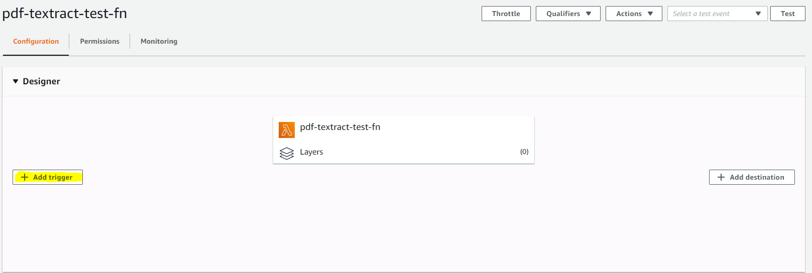
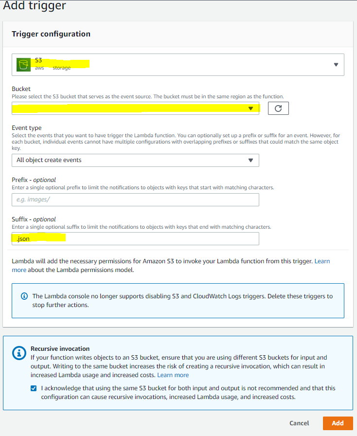

# Deployment Guide
Before deployment, you should have the following: 

* [AWS Account](https://aws.amazon.com/account/)
* [GitHub Account](https://github.com)
* [Node 10 or greater](https://nodejs.org/en/download/)

## Frontend Deployment

1) Use the __1-click deployment__ button provided above and start the deployment before continuing. 
2) Go to the [Amplify Console](https://aws.amazon.com/amplify/console/) and select the app you just created. 
3) Wait until Provision, Build, Deploy and Verify are all green.
4) From the Amplify console, navigate to __Backend environments__ -> __Storage__ and click on __View in S3__. We will be using this bucket later to connect to the Backend Lambda function. 
5) Navigate to AWS DynamoDB and find the table that Amplify created. It should start with Status. Copy that for the Backend as well. 

## Backend Deployment
Deploy the backend application onto AWS Lambda function.
### Build Instructions 
This application requires the frontend Amplfy Application to be setup and running on the same account and region. 
1. Run the `create_lambda.bat` script for Windows machines or `create_lambda.sh` for Linux machines and follow the prompts 
2. The AWS Account ID can be found in the Account Settings in the Console. 
3. The DynamoDB table name can be found by searching DynamoDB and clicking on __Tables__. The corresponding table should start with _Status_. 
4. The region should be the same as the region you used to create the Amplify Application ie. ca-central-1. 
3. In the AWS console, navigate to the newly created lambda function
4. Click on the Add Trigger Option 

4. Add a S3 create object trigger associated to the S3 bucket that Amplify created in the Frontend Deployment

### Updates
If you make any updates to `index.py`, you must run `lambda.sh` on a machine with the same OS as Python3.8 in AWS Lambda 
    - see [here](https://docs.aws.amazon.com/lambda/latest/dg/lambda-python.html) for more information
