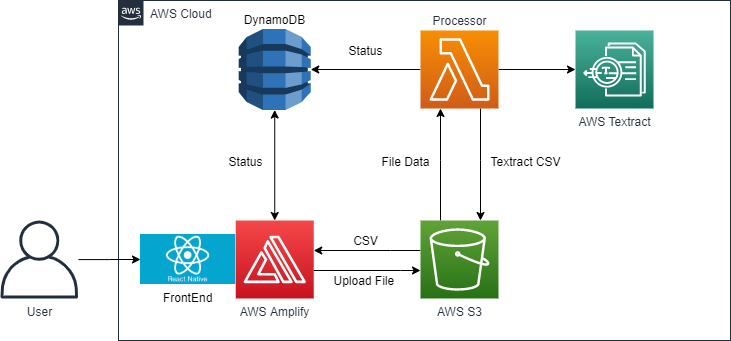

# Tabular Textract Application
The Tabular Textract Application is a prototype created for the UoT Economics Department with the ability to scan tabular-formatted data from PDF's and images and save the results into a CSV format. 

## Stack 
* __Frontend__ - ReactJS on NodeJS as the core framework.
* __Data__ - All data is saved in Amazon S3 and Amazon DynamoDB.
* __Auth__ - AWS Amplify and Cognito provides unique user login and authentication.
* __Backend__ - Lambda function that processes the uploaded file along with the confidence and page settings and uses AWS Textract to store the data and update the status in DynamoDB.

## High Level Architecture 

## Deployment 
To deploy this solution into your AWS account please follow the [deployment guide](deployment_guide.md)

