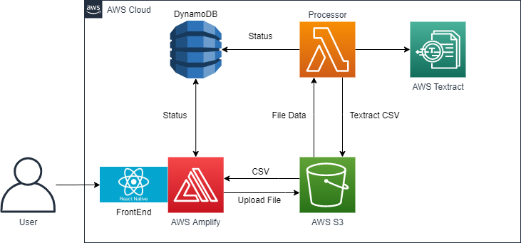

# Amazon Textract Tabular Formatted Parser Application
The Amazon Textract Tabular Formatted Parser Application is a prototype created for the UoT Economics Department with the ability to scan tabular-formatted data from PDFs and images and save the results into a CSV format. 

## Stack 
* __Frontend__ - ReactJS (React 18) built with Vite.
* __Data__ - All data is saved in Amazon S3 and Amazon DynamoDB.
* __Auth__ - AWS Amplify and Cognito provide unique user login and authentication.
* __Backend__ - A Python 3.13 AWS Lambda function, deployed as a container image via AWS SAM, that processes the uploaded file along with the confidence and page settings. It uses Amazon Textract to extract tabular data, stores the resulting CSV in Amazon S3, and updates the processing status in DynamoDB.

## High Level Architecture 



## Deployment 
To deploy this solution into your AWS account please follow the [deployment guide](deployment_guide.md)

## Local development

The frontend is a Vite app. After the backend has been deployed (which generates `src/aws-exports.js`), install dependencies and run the dev server from the project root:

```bash
npm install
npm run dev      # start the Vite dev server (http://localhost:3000)
npm run build    # production build into ./build
npm test         # run the test suite (Vitest)
```

## Credits

This prototype was coded by the UBC Students Jack Hou and Aamir Sheergar with the guidance from the UBC CIC technical team.

## License

This library is licensed under the Apache 2.0 License.